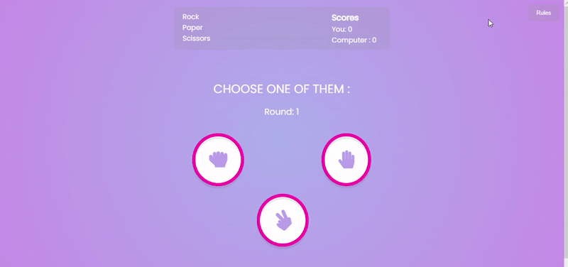

# Rock Paper Scissors Game ✋✌️👊

Rock, paper, and scissors game is a simple fun game in which both the players have to make a rock, paper, or scissors.  We will be designing the game using JavaScript where a player will be playing against the computer.  We will be designing the game using JavaScript where a player will be playing against the computer. If you win, your score will increase, and the same thing for the computer.

## 👀 𝗣𝗿𝗲𝘃𝗶𝗲𝘄
  

## ⚙️ 𝗧𝗲𝗰𝗵𝗻𝗼𝗹𝗼𝗴𝗶𝗲
*   Sass
*   Vanilla Js

## Authors

- [@Pardis-h](https://github.com/Pardis-h)